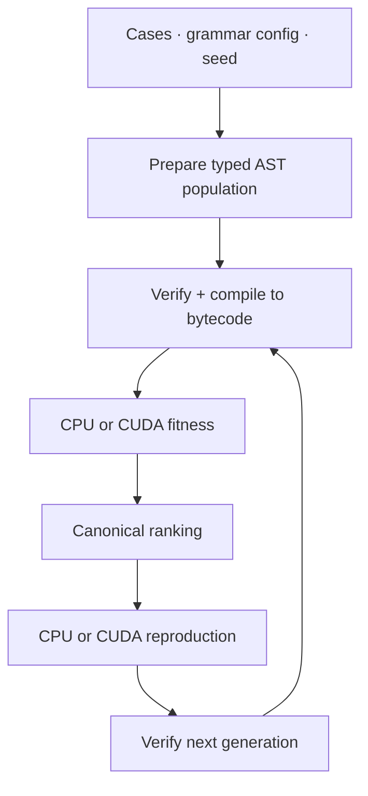

# GAGP

<p align="center">
  <strong>GPU-Accelerated Genetic Programming for Program Synthesis</strong>
</p>

<p align="center">
  <a href="VERSION.md"></a>
  
  
  
</p>

GAGP evolves typed prefix-AST programs, compiles them to a compact bytecode,
and evaluates entire populations on either a native CPU runtime or CUDA. It
combines GPU-accelerated fitness and reproduction with a verified, contract-led
program-synthesis pipeline.

> One semantic contract, two execution backends: the CPU path anchors correctness
> while CUDA accelerates population-scale search.

## Why GAGP?

- **GPU-first search** — CUDA backends accelerate both population fitness and
  reproduction, with optional preparation/evaluation overlap.
- **Correctness by construction** — typed generation, structural verification,
  bytecode verification, and dedicated CPU/GPU parity tests guard every trust
  boundary.
- **Reproducible experiments** — fixed populations, deterministic seeds,
  grammar profiles, timing output, and compact benchmark manifests support fair
  comparisons.
- **A lean native core** — language semantics, compilation, evolution, and
  execution live in C++/CUDA. Python is limited to independent dataset and
  experiment tooling.
- **Contract-led development** — grammar, bytecode, builtins, fitness, fixtures,
  and search-space configuration are defined in release-governed specifications.

## Capabilities

| Capability | CPU | CUDA GPU |
| --- | :---: | :---: |
| Bytecode execution and fitness | ✓ | ✓ |
| Population evaluation | ✓ | ✓ |
| Tournament selection and reproduction | ✓ | ✓ |
| Typed-subtree crossover and mutation | ✓ | ✓ |
| Reproduction preparation/evaluation overlap | — | ✓ |
| One-AST evaluation command | ✓ | — |

CUDA execution supports the documented device payload limits and deterministic
fallback behavior. The exact public contracts live in the
[specification index](spec/README.md).

## Quick start

### Requirements

- CMake 3.16 or newer
- A C++17 compiler
- An NVIDIA CUDA toolkit and compatible GPU for CUDA backends
- Python 3.10 or newer only for operational tools and repository checks

### Build and test

```bash
git clone https://github.com/hschi1106/gagp.git
cd gagp

cmake -S cpp -B cpp/build -DCMAKE_BUILD_TYPE=Debug
cmake --build cpp/build -j
ctest --test-dir cpp/build --output-on-failure
```

For a CPU-only build, configure with `-DGAGP_ENABLE_CUDA=OFF`.

### Run GPU-accelerated evolution

```bash
cpp/build/gagp_evolve_cli \
  --cases data/fixtures/simple_exp_1024.json \
  --engine gpu \
  --repro-backend gpu \
  --repro-overlap on \
  --blocksize 256 \
  --population-size 64 \
  --generations 2 \
  --show-program ast \
  --out-json /tmp/gagp-simple-exp.run.json
```

GPU-capable paths automatically choose the least-used visible CUDA device. Set
`GAGP_CUDA_DEVICE=0` to select a specific visible-device index.

## How it works



CPU and GPU evaluation converge on the same fitness-vector boundary before
ranking. Selecting a GPU backend changes execution and scheduling, not the
language or operator contract. See the [architecture](docs/design/architecture.md)
and [native dataflow](docs/design/dataflow.md) for the full model.

## Operational tools

The dependency-free Python package handles PSB datasets, fixture conversion,
population seeds, regression runs, comparisons, and manifests. It does not
implement product runtime semantics.

```bash
python3 -m venv .venv-tools
.venv-tools/bin/pip install -e tools
.venv-tools/bin/gagp-tools --help
```

Follow the complete artifact pipeline in the
[operational tools guide](tools/README.md).

## Documentation

| Start here | What it covers |
| --- | --- |
| [Specifications](spec/README.md) | Normative grammar, bytecode, builtin, fitness, fixture, and grammar-config contracts |
| [Architecture](docs/design/architecture.md) | Native components, dependency direction, and stable invariants |
| [Dataflow](docs/design/dataflow.md) | End-to-end execution, evolution, and artifact flow |
| [Development](docs/guides/development.md) | Builds, presets, tests, sanitizers, fuzzing, and GPU policy |
| [CLI reference](docs/reference/cli.md) | Mechanically checked flags and defaults |
| [Benchmarking](docs/guides/benchmarking.md) | Reproducible fixed-population CPU/GPU comparisons |
| [PSB workflow](docs/guides/psb-workflow.md) | Dataset acquisition, fixtures, regression, and reports |
| [Grammar configuration](docs/guides/grammar-config.md) | Search-space profiles and replay |
| [Documentation index](docs/README.md) | Ownership of every maintained document |

## Repository layout

```text
gagp/
├── cpp/
│   ├── include/gagp/     Public C++ interfaces
│   ├── src/runtime/      CPU VM, CUDA runtime, and payload transport
│   ├── src/evolution/    Compiler, generation, operators, and evolution loop
│   ├── src/cli/          Native command-line entry points
│   └── tests/            Unit, contract, property, fuzz, and parity tests
├── spec/                 Normative behavioral contracts
├── docs/                 Design, guides, references, and refactor evidence
├── tools/                Independent operational Python package
├── tests/repository/     Runtime-independent repository checks
├── configs/grammar/      Search-space profiles
└── benchmarks/           Compact validation manifests and provenance
```

The mechanically checked directory map is maintained in the
[repository-layout reference](docs/reference/repository-layout.md).

## Testing

Run all three verification layers from the repository root:

```bash
ctest --test-dir cpp/build --output-on-failure
python3 -m unittest discover -s tools/tests -p 'test_*.py' -v
python3 -m unittest discover -s tests/repository -p 'test_*.py' -v
```

Focused CTest labels include `unit`, `contract`, `property`, `gpu`,
`cpu_gpu_parity`, and `tooling`. Sanitizer and libFuzzer workflows are described
in the [development guide](docs/guides/development.md).

## Contributing

Before changing behavior, identify the owning document in
[spec/](spec/README.md) and update its conformance tests in the same change.
Parser or output changes must also update the checked
[CLI reference](docs/reference/cli.md). Repository conventions and GPU profiling
rules are collected in [AGENTS.md](AGENTS.md).

GAGP is currently at release **1.0.0**. See [VERSION.md](VERSION.md) for the
release contract.
